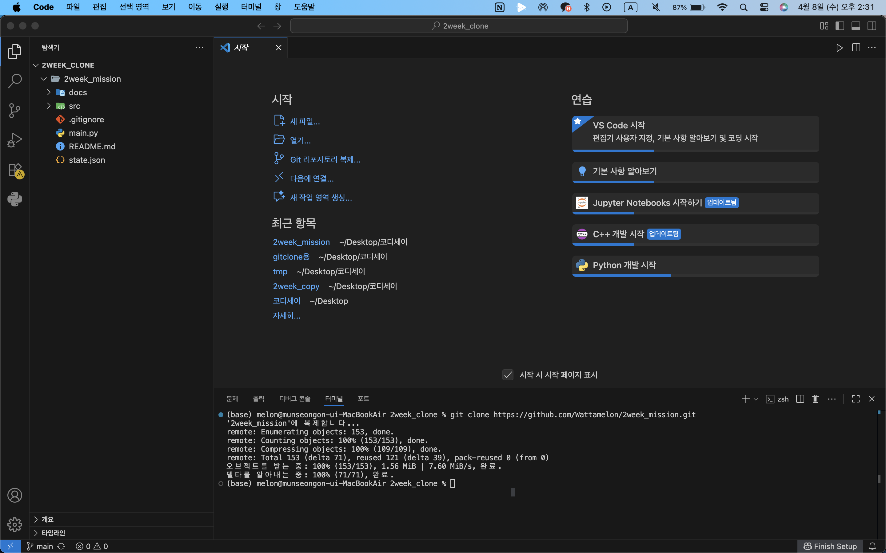
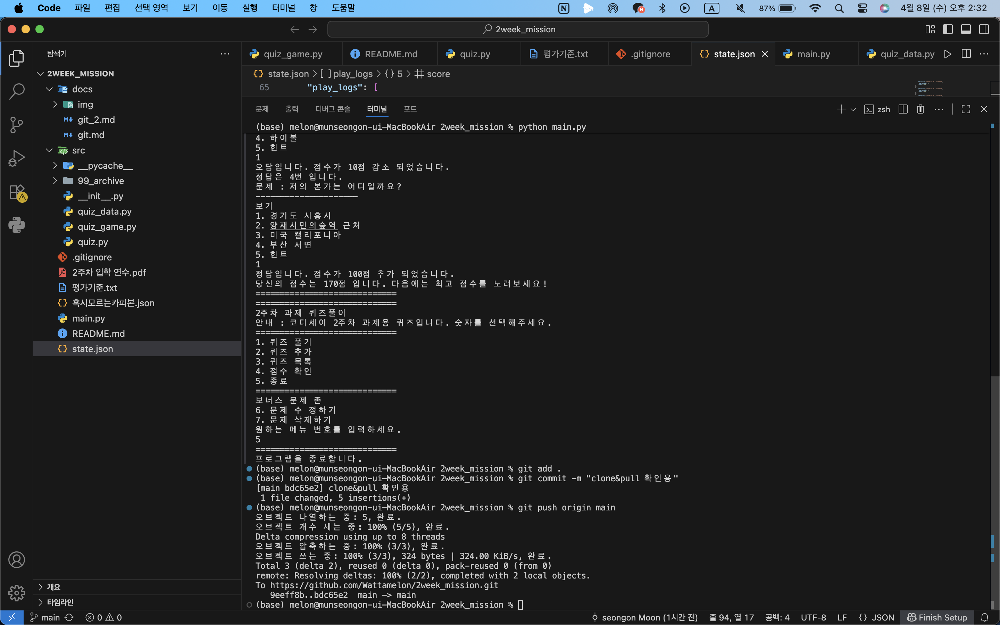
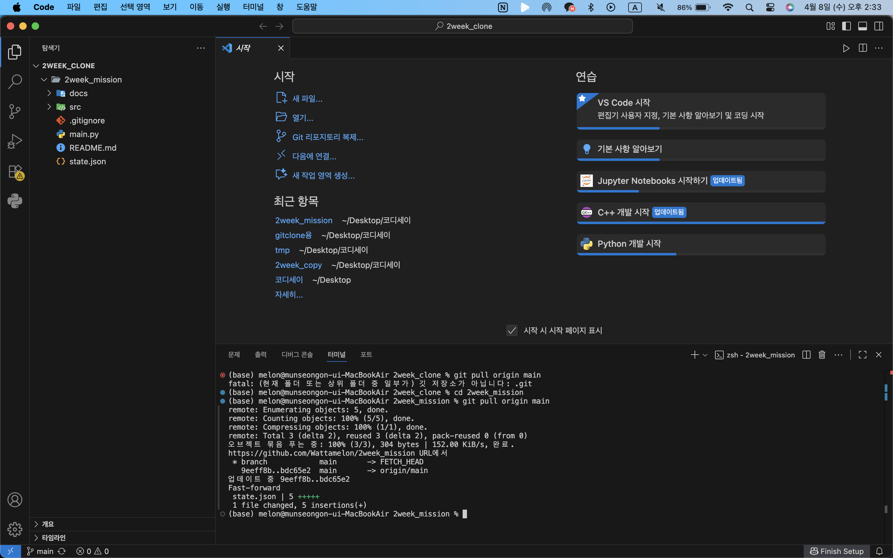

## 📌 프로젝트 개요

이 프로젝트는 Python과 Git을 활용하여 **터미널에서 실행되는 퀴즈 게임**을 구현하는 과제입니다.
사용자는 퀴즈를 풀고, 새로운 퀴즈를 추가하며, 점수를 기록할 수 있습니다.

또한 JSON 파일을 활용하여 프로그램 종료 후에도 **퀴즈 데이터와 점수, 플레이 기록이 유지되는 데이터 영속성**을 구현했습니다.

---

## 🎯 퀴즈 주제 선정 이유

본 프로젝트에서는 개인적인 질문 기반의 퀴즈를 주제로 선택했습니다.
이유는 다음과 같습니다:

* 직접 문제를 만들기 쉽고 확장성이 높음
* 프로그램 기능 구현에 집중할 수 있음
* 데이터 저장 및 관리 구조를 이해하기에 적합

---

## ▶️ 실행 방법

```bash
python main.py
```

---

## ⚙️ 기능 목록

### 1. 퀴즈 풀기

* 저장된 퀴즈를 랜덤으로 출제
* 정답/오답 판정 및 점수 계산 (정답시 100점 , 오답시 -10점)
* 힌트 기능 (게임당 2회 사용 가능)

### 2. 퀴즈 추가

* 문제, 선택지 4개, 정답, 힌트를 입력받아 추가
* 입력 검증 (공백, 숫자 범위 등)
* 추가 후 JSON 파일에 저장

### 3. 퀴즈 목록 확인

* 현재 등록된 퀴즈 목록 출력
* 퀴즈가 없는 경우 예외 처리

### 4. 점수 확인

* 최고 점수 출력

### 5. 데이터 저장 및 유지

* 프로그램 종료 후에도 데이터 유지
* JSON 파일 기반 저장

---

## ⭐ 보너스 기능

### ✔ 랜덤 출제

* 문제 순서를 랜덤으로 섞어 출제

### ✔ 문제 수 선택

* 사용자가 풀 문제 개수를 선택 가능

### ✔ 힌트 기능

* 문제당 힌트 제공
* 게임당 최대 2회 사용 가능

### ✔ 퀴즈 삭제 기능

* id 기반으로 특정 퀴즈 삭제 가능
* 삭제 후 JSON 파일 반영

### ✔ 점수 기록 히스토리

* 플레이 시간, 푼 문제 수, 점수 기록 저장
* 모든 게임 기록 누적 저장

---

## 🗂 파일 구조

```text
2WEEK_MISSION/
│
├── main.py
├── state.json
│
└── src/
    ├── quiz.py
    ├── quiz_game.py
    └── quiz_data.py
```

---

## 🧠 클래스 구조

### Quiz 클래스

* 하나의 퀴즈를 표현
* 속성:

  * question
  * choices
  * answer
  * hint
* 메서드:

  * 문제 출력
  * 정답 확인

---

### QuizGame 클래스

* 전체 게임 흐름 관리
* 주요 역할:

  * 메뉴 처리
  * 퀴즈 진행
  * 퀴즈 추가/삭제
  * 데이터 저장/불러오기
  * 점수 및 기록 관리

---

## 💾 데이터 파일 설명 (state.json)

### 📍 위치

프로젝트 루트 디렉토리

### 📍 역할

* 퀴즈 데이터 저장
* 최고 점수 저장
* 플레이 기록 저장

### 📍 구조 예시

```json
{
  "quizzes": [
    {
      "id": 1,
      "question": "문제 내용",
      "choices": ["1", "2", "3", "4"],
      "answer": 2,
      "hint": "힌트 내용"
    }
  ],
  "best_score": 390,
  "play_logs": [
    {
      "playtime": "2026.04.08 - 21:30:00",
      "num_solved": 5,
      "score": 390
    }
  ]
}
```

---

## 🔧 예외 처리

다음과 같은 상황을 처리하도록 구현했습니다:

* 숫자 입력 오류 (문자 입력)
* 범위 밖 입력
* 공백 입력
* 퀴즈가 없는 경우
* JSON 파일이 없거나 손상된 경우
* Ctrl+C / EOF 발생 시 안전 종료 및 데이터 저장

---

## 🧩 설계 포인트

* **클래스 기반 설계**

  * Quiz: 데이터 단위
  * QuizGame: 전체 흐름 관리

* **기능별 메서드 분리**

  * 입력 처리
  * 게임 진행
  * 저장/불러오기

* **데이터 영속성**

  * JSON 파일을 통한 상태 유지
  
---

## 🧪 테스트 및 검증

* 메뉴 기능 정상 동작
* 입력 예외 처리 완료
* 퀴즈 추가/삭제 반영 확인
* 프로그램 재실행 시 데이터 유지 확인
* 점수 및 히스토리 정상 저장

---


깃허브 pull & clone








